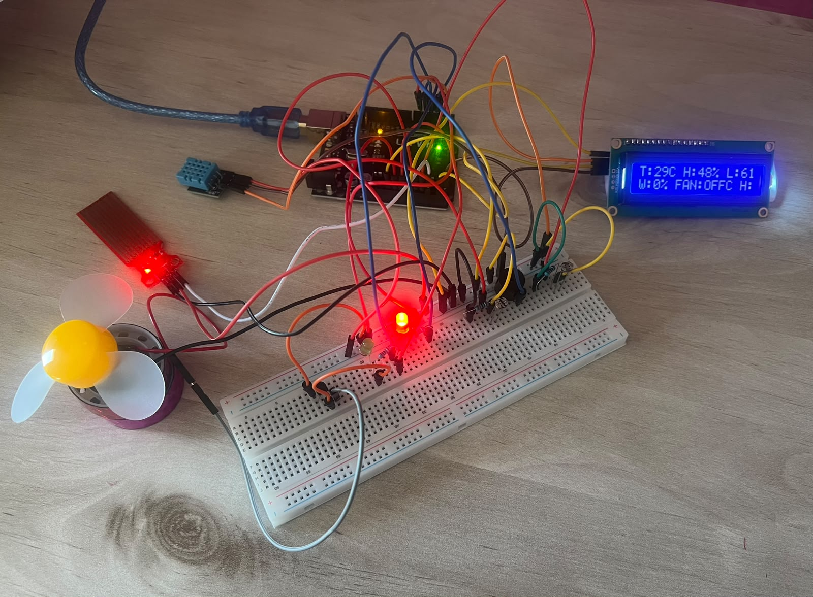
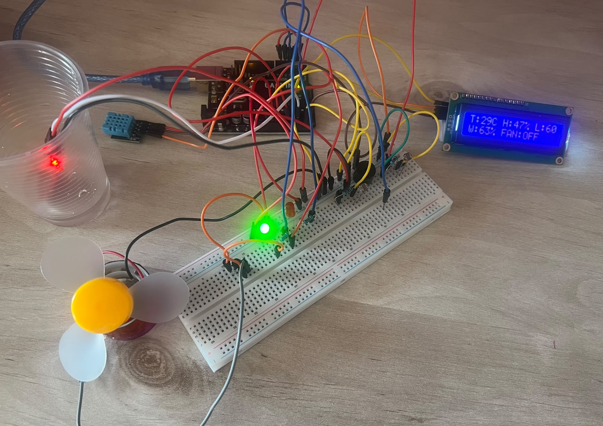
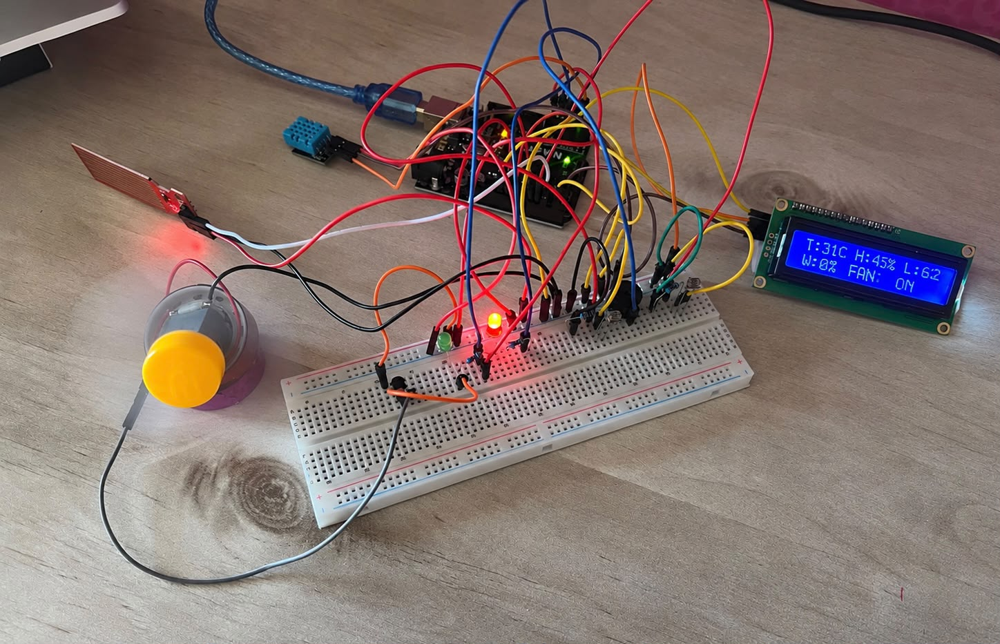

# 🌱 Smart Environmental Monitoring System

## 📌 Project Overview

The **Smart Environmental Monitoring System** is an Arduino-based project designed to monitor different environmental conditions in real time.

The system measures **temperature, humidity, light intensity, and water level** using multiple sensors. The collected data is displayed on a **16×2 LCD**, while **LEDs and a buzzer provide visual and audio alerts** when an unsafe condition is detected.

The system also controls a **DC fan automatically**. When the temperature reaches **30°C or higher**, the fan turns on to provide cooling.

This project demonstrates practical experience in **Arduino programming, sensor integration, real-time monitoring, automatic control, and hardware integration**.

---

## ⚙️ How It Works

The system continuously reads data from the connected sensors and processes the readings using the Arduino UNO.

### 🌡️ Temperature & Humidity

The **DHT11 sensor** measures:

- Temperature in Celsius (°C)
- Relative humidity (%)

The temperature is also used to control the cooling fan.

If the temperature is **30°C or higher**, the system considers the condition unsafe and automatically turns the fan **ON**.

### 💡 Light Monitoring

Two **LDR (photoresistor) sensors** are used to measure the surrounding light level.

The Arduino reads both sensors and calculates their average value. The result is converted into a percentage and displayed on the LCD.

### 💧 Water Level Monitoring

The **water level sensor** measures the amount of water detected.

The sensor reading is converted into a percentage and displayed on the LCD.

If the water level falls below **15%**, the system considers it a danger condition and activates the warning indicators.

### 🚨 Warning System

The system uses a **red LED, green LED, and buzzer** to indicate the current system condition.

- 🟢 **Green LED ON:** The monitored conditions are within the defined safe range.
- 🔴 **Red LED ON:** A danger condition has been detected.
- 🔊 **Buzzer ON:** An audible warning is activated when a danger condition is detected.

A danger condition occurs when:

- Temperature ≥ **30°C**, or
- Water level < **15%**

### 💨 Automatic Fan Control

The DC motor with the fan blade is used as an automatic cooling system.

- Temperature < 30°C → **Fan OFF**
- Temperature ≥ 30°C → **Fan ON**

---

## 📸 Project Gallery

### 1. Normal Temperature & Low Water Level

In the first test, the system reads:

- **Temperature:** 29°C
- **Humidity:** 48%
- **Light:** 61%
- **Water:** 0%
- **Fan:** OFF

The water sensor is not placed in water, so the detected water level is **0%**.

Since the temperature is below **30°C**, the fan remains OFF.

However, the water level is below the defined **15% safety threshold**, so the system detects a danger condition. As a result, the **red LED and buzzer are activated**.

---

### 2. Normal Conditions

In the second test, the water sensor is placed in water and the system reads:

- **Temperature:** 29°C
- **Humidity:** 47%
- **Light:** 60%
- **Water:** 63%
- **Fan:** OFF

The water level is now **63%**, which is above the 15% danger threshold.

The temperature is also below **30°C**, so there is no danger condition.

Therefore, the **green LED is ON**, the **red LED is OFF**, the buzzer is OFF, and the fan remains OFF.

---

### 3. High Temperature & Low Water Level

In the third test, the system reads:

- **Temperature:** 31°C
- **Humidity:** 45%
- **Light:** 62%
- **Water:** 0%
- **Fan:** ON

The temperature has reached **31°C**, which is above the defined **30°C threshold**.

As a result:

- 🔴 The red LED turns ON.
- 🔊 The buzzer is activated.
- 💨 The fan automatically turns ON.

The water sensor is also outside the water, resulting in a water level reading of **0%**, which is below the 15% threshold and also contributes to the danger condition.

This test demonstrates the system's ability to **detect an unsafe condition and automatically respond by activating the cooling fan and warning indicators**.
